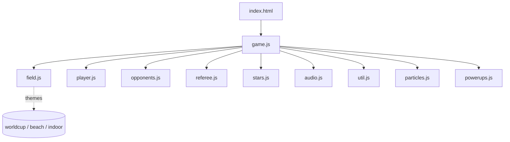
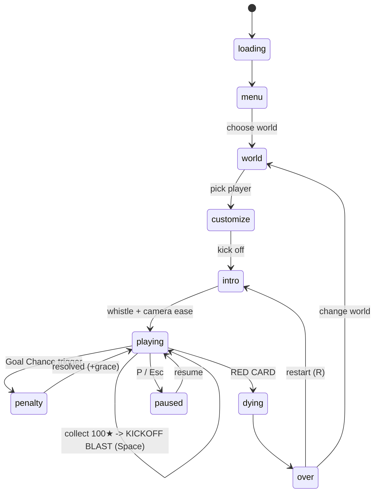

# ⚽ Kickoff Rush

A football-themed **3-lane endless runner** built with HTML5 + [Three.js](https://threejs.org/) (r128).
Dribble the ball down an endless pitch, dodge charging rival players, collect gold stars, survive the
referee's **cards**, and — when the moment is right — step up for a cinematic **Goal Chance** penalty
and unleash a **KICKOFF BLAST** power run.

Everything is procedural: geometry, textures, crowds, and a full Web Audio soundscape. No art or audio
asset files. No build step.

### Theme: KICKOFF — more than a match

KICKOFF isn't just the start of a game — it's the first step of every journey.
Every player starts somewhere. The cards you earn are the lessons along the way.
The Goal Chance is your moment of truth. The KICKOFF BLAST is finding your flow.
Your run ends not when you lose, but when you're sent off — and then you pick
yourself up and **kick off again**. This is a game about beginnings, perseverance,
and the path every footballer walks from the first whistle to the final card.

---

## ✨ Features

- **3-lane endless runner** with smooth lane switching, jumping and rolling (with squash & stretch juice).
- **Referee card system (lives = cards)** — 2 lives shown as real green cards in the HUD. A foul = **YELLOW CARD**,
  a second = **RED CARD** (sent off). A **GREEN CARD** power-up restores a life and keeps you a safe player.
- **Four power-ups**: SPEED, GOLDEN BOOT (star magnet), SHIELD, and the GREEN CARD.
- **Three themed worlds as a career "life journey"** — **Beach → Indoor → World Cup**
  (The Roots → The Grind → The Prime) that swap scenery + lighting and unlock by
  lifetime progression (see [Career](#-career--level-unlock)).
- **Charging rivals** that chase and cut across lanes, plus a wide **Goalkeeper** in the Penalty Box.
- **Goal Chance penalty phase** — a slow-mo cinematic lead-in, an aiming marker, and a keeper you must beat.
- **KICKOFF BLAST** — a charged, invincible power run unlocked every 100 stars.
- **Cinematic kickoff**: overhead kickoff with player + rival + referee whistle, then an eased drop into chase cam.
- **Living galleries**: instanced stickman crowds, flag-wavers, and random support messages after 25 m.
- **Procedural audio** (Web Audio API): whistle, jump, roll, star, crash, kick, goal fanfare, combo jingles, and a looping chant.
- **5 generic kits** (Red Devils, Blue Lions, Golden Eagles, Black Panthers, Rainbow FC) with their own
  balanced stats — pick a kit colour, not a real player. Plus an editable **player name + jersey number**
  (default #10) shown on the pitch.
- **Touch + keyboard** controls, pause menu, volume sliders, and a local top-5 leaderboard.
- **Post-processing**: UnrealBloom + vignette + FXAA; camera shake, FOV punch, and slow-motion juice.

---

## 🏟️ Worlds

| World       | Look                                                                 | Lighting |
|-------------|----------------------------------------------------------------------|----------|
| `worldcup`  | Open stadium, cheering tiered crowds, banners/placards, floodlights, drifting clouds. | bright daylight, blue sky |
| `beach`     | Sandy pitch by the sea, sun glow, curved palms, umbrellas, beach bleachers. | warm sun key light |
| `indoor`    | Enclosed arena, roof spotlights, close stands, scoreboard, darker hall. | dim, glowing roof lamps |

> The world is chosen on the World Screen and can be changed from the game-over / pause menus.
> Worlds only change scenery and lighting — gameplay is identical across all three.

---

## 🏆 Career — Level Unlock

KICKOFF is the first step of every journey. The three worlds form a footballer's **life journey**,
unlocked by **lifetime cumulative stats** (persisted in `localStorage`):

| Level | World | Meaning | Unlock (all three required) |
|-------|-------|---------|------------------------------|
| 1 | **Beach** | The Roots — where it started | Available from start |
| 2 | **Indoor** | The Grind — hard years | 3 lifetime goals **AND** 2000 m **AND** 200 ⭐ |
| 3 | **World Cup** | The Prime — he made it | 8 lifetime goals **AND** 5000 m **AND** 600 ⭐ |

- When you cross a threshold **mid-run**, a **non-interrupting toast** celebrates the unlock
  (*"LEVEL 2 UNLOCKED!"*) — you keep running.
- On the **World Screen**, locked maps show 🔒 + *"Reach …"*; a freshly unlocked map shows a **NEW!** badge.
- A **Career screen** (Main Menu → CAREER) shows your 3D player on one side and your lifetime
  Goals / Distance / Stars + per-level progress on the other.
- Each world adds a **gentle difficulty ramp** (Indoor +~12% speed / +20% density; World Cup +~22% / +35%).

### Player identity & kits
On both the **Career** and **Customize** screens you set your **name** + **jersey number**
(default **#10**). You also pick one of **5 generic kits** (colour-based, each with its own balanced
stats) — no real-player presets. Your name + number are baked onto the jersey.

### Reset progress
A **RESET PROGRESS** button lives in the **pause menu** and the **main menu**. It opens a confirmation
popup warning that all progress and `localStorage` data will be cleared. Confirming does a **full factory
reset** — clears unlocks, lifetime stats, and the local top-5 leaderboard.

`localStorage` keys: `kickoff_career` (unlocks + identity + lifetime stats) and
`kickoff_leaderboard` (top-5). A run's RED CARD ends the run but **never** resets your career progress.

---

## 🎴 The Card System (Lives)

Your "lives" are modeled on real football refereeing and rendered as **actual cards** in the HUD.

- You start with **2 green cards** (`🟩 🟩`). Each card is one life.
- **Hit an obstacle** (without a shield) → you lose a card and a **YELLOW CARD** toast appears.
  You get ~2 s of invincibility (i-frames) and the defenders right around you are cleared for breathing room.
- **Lose your second card** → **RED CARD** → you're sent off and the run ends (with a red screen flash).
  This mirrors real football: *two yellows = red*.
- **GREEN CARD** power-up → restores a spent card (up to 2) and shows a **GREEN CARD / Safe player** toast.
  Grab it to stay alive after a foul.
- A **SHIELD** absorbs one hit entirely (no card lost) and shatters in green.

| Event | Card shown | Meaning |
|-------|-----------|---------|
| Foul (1st) | 🟨 YELLOW | Warning — one more and you're out |
| Foul (2nd) | 🟥 RED | Sent off — game over |
| Pickup | 🟩 GREEN | Safe player — card cleared / life restored |

The HUD slots turn from solid green (`green`) to greyed-out (`used`) as you lose cards.

---

## 🎮 Controls

| Action              | Keyboard                | Touch              |
|---------------------|-------------------------|--------------------|
| Switch lane         | `←` `→` / `A` `D`       | Swipe left / right |
| Jump                | `↑` / `W` / `Space`     | Swipe up           |
| Roll / slide        | `↓` / `S`              | Swipe down         |
| **KICKOFF BLAST**   | `Space` (when ready)    | — (desktop)        |
| **Penalty shot**    | `Space` (during Goal Chance aim) | —       |
| Pause               | `P` / `Esc`             | `ESC` HUD button   |
| Mute                | `M`                     | `Mute` (pause)     |
| Restart             | `R`                     | `RESTART` buttons  |

Menus are also navigable with `Space` / `Enter` / `Esc`.

---

## 🕹️ Game Mechanics

### Core loop
The pitch scrolls toward you (`-z`). **Distance (m)** and **score** are tracked on the HUD.
Speed scales with distance: `BASE_SPEED(18) + min(22, distance/90)`, multiplied by team speed,
any active speed boost, and the KICKOFF BLAST multiplier. Hit an obstacle and you lose a card.

### Obstacles
| Type       | Appearance | How to beat | Behaviour |
|------------|-----------|------------|-----------|
| `player` (rival) | Blue rival runner | **Switch lanes** | Spawns further back and **charges/crosses toward your current lane** when within ~24 m |
| `keeper`   | Wide teal keeper, arms spread | **JUMP** (clear height 1.6) | Appears in the **Penalty Box** (not on the open track) |

Collision happens only when the obstacle is near your `z` and you share its lane (rival) or are below
the clear height (keeper) — unless you're shielded or in a KICKOFF BLAST.

**Style bonuses** for clean dodges:
- **Close Call** (+50) — switch lanes just as a rival passes.
- **Limbo King** (+100) — roll under a keeper.
- **Air Master** (+25) — collect a star while jumping.
- **Speed Demon** (+200) — cover 100 m without rolling.

### Stars ★
Gold extruded 5-point stars sit in the open lane of each chunk. Collect them to fill the
**KICKOFF METER** (every **100 stars**) and to score.

### Combo & scoring
Consecutive stars build a **combo multiplier** with a `3.5 s × team combo factor` window:
`x1` (<5), `x2` (5), `x3` (15), `x4` (30), `x5` (50).
Score per star = `round(10 × mult × team.star)`.
Combo breaks (red flash) on a hit or when the timer expires.

**Score** = stars (×combo×team) + style bonuses + penalty goals. Distinct from distance.

### KICKOFF BLAST (every 100 stars) 🔋
1. The top **KICKOFF METER** fills; a *"KICKOFF BLAST READY — press SPACE"* prompt appears (run continues).
2. Press **`Space`** to fire:
   - The ball is kicked forward; your player becomes a glowing, translucent **ghost**.
   - All current obstacles are **smashed** (smoke) and become harmless; no new ones spawn.
   - Duration is **per-team** (`blast`: 5–6 s). Confetti + whistle + goal fanfare on fire.
3. When it ends, the ball smoothly returns to your feet and normal play resumes.

### Goal Chance (Penalty Phase) 🥅
Triggered at escalating, jittered distances — first at **500 m**, then gaps of `~1000 + (index-1)*250 ± jitter`.
- A `penMap` HUD track shows **DISTANCE TO GOAL**.
- **Cinematic lead-in**: within 55 m of the trigger the run freezes into slow-mo while a cosmetic
  goal + keeper fly toward you (no collision), then hands off to the real phase.
- **Phases**: `suspense` → `aim` (sweeping marker) → `shot` → `result`.
  The keeper **pre-leans** to a dive side during aim; shoot the **opposite** side.
- `Space` shoots to the marker side. **GOAL** = shot side ≠ keeper dive (ball into open net, +score/style,
  confetti, 3 s speed boost). **SAVE** = same side (keeper catches, deflects, "no harm done", keep running).
- **Difficulty scales 0→1** with `distance/6000`: keeper holds neutral longer then snaps the tell late;
  the aim marker sweeps faster. Auto-miss safety at 6 s.
- After resolve: brief banner, schedule next penalty, return to running with 1.2 s grace.

### Spectators
Stickmen fill the stand tiers (stadium/indoor) and beach bleachers. A few **wave flags**, and after
**25 m** random **support messages** ("KEEP GOING", "VAMOS", "ANKARA MESSI"…) fade in/out on the stands.

### Kickoff intro
On start, the camera shows an **overhead kickoff** (player, a lined-up rival, referee whistling),
the banner reads *"REFEREE WHISTLES — KICK OFF!"*, then *"GAME STARTS!!"* as the camera eases into the
third-person chase and the referee walks off for good.

---

## 👕 Players & Teams

Pick from **8 legendary players** on the Customize screen (3D rotating preview + player cards).
Jerseys (front brand "KX" + country badge + number; back name + number) are generated procedurally.

| Key       | Name        | # | Country   | Jersey     | Speed | Star | Combo | Blast |
|-----------|-------------|---|-----------|-----------|-------|------|-------|-------|
| `messi`   | MESSI       | 10| ARGENTINA | blue      | 1.05  | 1.0  | 1.0   | 5     |
| `ronaldo` | RONALDO     | 7 | PORTUGAL  | red       | 1.00  | 1.0  | 1.0   | 6     |
| `neymar`  | NEYMAR      | 10| BRAZIL    | yellow    | 1.00  | 1.0  | 1.6   | 5     |
| `mbappe`  | MBAPPÉ      | 10| FRANCE    | blue      | 1.05  | 1.0  | 1.0   | 5     |
| `salah`   | M. SALAH    | 10| EGYPT     | red       | 1.00  | 1.1  | 1.0   | 5     |
| `kane`    | KANE        | 9 | ENGLAND   | white     | 1.00  | 1.0  | 1.0   | 5     |
| `haaland` | HAALAND     | 9 | NORWAY    | red       | 1.00  | 1.0  | 1.0   | 6     |
| `modric`  | MODRIC      | 10| CROATIA   | red       | 1.00  | 1.0  | 1.6   | 5     |

`Star` multiplies star score; `Combo` widens the combo window; `Blast` sets KICKOFF BLAST duration (s).

---

## 🧱 Architecture

```
kickoff/
├── index.html          # canvas + HUD + all overlays (loading, world, customize, intro,
│                       #   penalty, kickoff-blast, game-over, main menu, options, pause, farewell)
├── css/
│   └── style.css        # all UI styling (incl. card HUD + card toasts)
├── assets/              # PNG loading / lobby / settings backgrounds only
│   ├── loading_bg_worldcup.png / loading_bg_beach.png / loading_bg_indoor.png
│   ├── lobby_bg_main.png
│   └── settings_bg.png
├── EXTRAFEATURE.md      # planned feature backlog (not all implemented)
└── js/
    ├── audio.js         # Web Audio: sfx + music + whistle/goal fanfare + crowd ambient
    ├── field.js         # themed worlds, pitch, crowds, flags, support messages
    ├── util.js          # shared helpers: ball texture, front/back jersey textures, colour shade
    ├── player.js        # user-controlled footballer + dribbled ball + run animation
    ├── opponents.js     # 'player' (blue rival, lane-charging) + 'keeper' (spread keeper)
    ├── referee.js       # striped whistle-referee for the kickoff (non-colliding)
    ├── stars.js         # gold star collectible (extruded 5-point mesh)
    ├── particles.js     # pooled sprite particles: starBurst, confetti, smoke, shatter
    ├── powerups.js      # orb/card types: speed, magnet (golden boot), shield, green card
    └── game.js          # orchestrator: scene, camera, input, state machine, loop,
                        #   kickoff-blast, penalty/goal-chance, collisions, scoring, cards
```



### State machine


Game-over stats: Distance, Score, Stars, Best Combo, Close Calls, Kickoff Blasts, Penalty Goals,
Style Bonus, and a **Best (m)** banner. A local top-5 leaderboard (by score) is shown.

---

## 🔊 Audio

All sound is generated procedurally with the Web Audio API (no asset files):
`jump`, `roll`, `ball`, `star`, `crash`, `kick`, a two-blast `whistle` (ducks the music),
`goal` fanfare, `combo` jingle, `style` chime, `power` whoosh, `shieldBreak`, plus a looping
arpeggio and a crowd-ambience bed that rises with your combo. Press `M` to mute.

Volume sliders in the pause menu / options screen bind to `K.Audio.musicGainSet` (music, ×0.5)
and `K.Audio.masterGainSet` (SFX, ×0.6). Defaults: Music 50, SFX 60.

---

## 🚀 How to run

No build step. Open `index.html` in a modern browser.
> Three.js is loaded from a CDN, so an internet connection is required on first load.

Or serve locally:
```bash
# Python
python -m http.server 8000
# then visit http://localhost:8000

# Node
npx serve .
```

---

## ⚙️ Tuning (in `js/game.js` / `js/field.js`)

| Constant / value     | Meaning                                  | Default |
|----------------------|------------------------------------------|---------|
| `BASE_SPEED`         | starting run speed (m/s)                 | 18      |
| `MAX_LIVES`          | lives = cards (green cards in HUD)       | 2       |
| `PLAYERS[...].blast` | KICKOFF BLAST duration (s)               | 5–6     |
| `INTRO_HOLD` / `INTRO_TRANS` | kickoff hold / camera transition (s) | 3.2 / 1.4 |
| `SHOW_AFTER`         | metres before support messages appear    | 25      |
| `nextFreeKickAt`     | stars per KICKOFF BLAST charge           | 100     |
| `nextPenaltyAt`      | first Goal Chance distance (m)           | 500     |
| `PEN_LEAD`           | slow-mo lead-in runway (m)               | 55      |
| `COMBO_TIMEOUT`      | base combo window (s)                    | 3.5     |

Power-up spawn weights live in `spawnStarsOnly`: `['speed','magnet','magnet','shield','greencard']`.

---

## 📜 License

MIT — do whatever you like, just have fun and score some goals. ⚽
